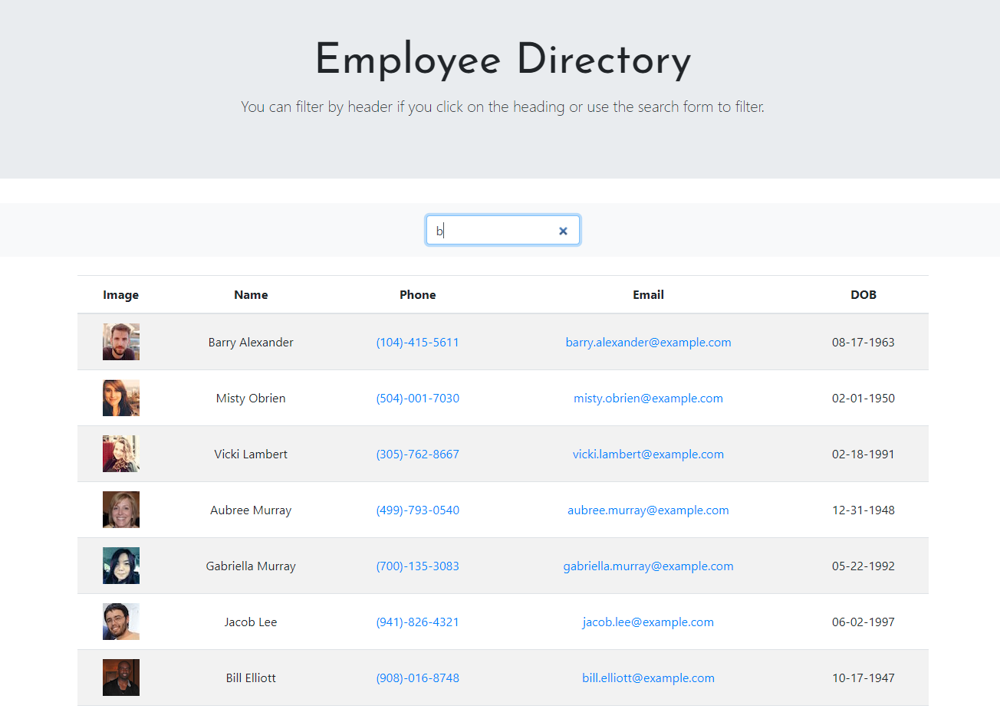
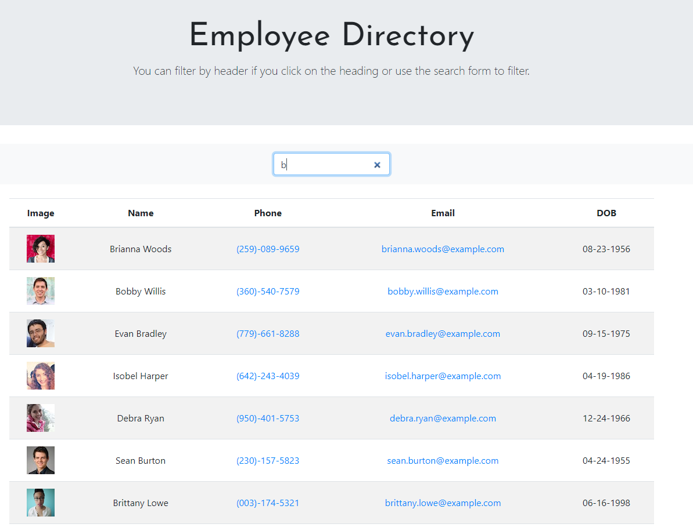
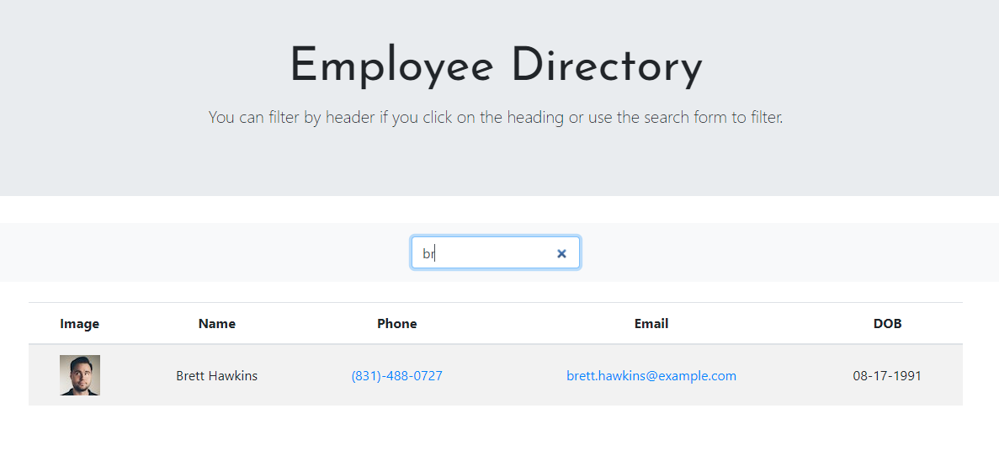

# Employee Directory

## Overview

For this assignment, you'll create a employee directory with React. This assignment will require you to break up your application's UI into components, manage component state, and respond to user events.

## User Story

* As a user, I want to be able to view my entire employee directory at once so that I have quick access to their information.

## Business Context

An employee or manager would benefit greatly from being able to view non-sensitive data about other employees. It would be particularly helpful to be able to filter employees by name.

## Acceptance Criteria

Given a table of random users generated from the [Random User API](https://randomuser.me/), when the user loads the page, a table of employees should render. 

The user should be able to:

  * Sort the table by at least one category

  * Filter the users by at least one property.


### See Live Application
[Click Here](https://lemanou7.github.io/employeeDirectory/) to see the application.


### Installation


<!-- GETTING STARTED -->

This is some useful steps, you must meet to run this Express Application correctly 

### Prerequisites
You can use any code editor of user choise, i use Vs Code because it is open source and it understand git and do syntax highlighting very nicely.

* Go to
  [Click Here](https://code.visualstudio.com/download) to download Vs Code to your computer.
  

1. Clone the repo
   ```sh
   git clone https://github.com/lemanou7/employeeDirectory.git
   ```
2. Get a linux shell emulator like Git bash or Powershell then:
    ```sh
    cd to where your repository folder is located in your computer
    ```
3. Install nodeJs on your machine


4. Install all the dependencies by entering this command in your Terminal and please add your database credentials(username, password and db name)
   ```sh
   npm install then npm start
   ```

4. Go in your web browser to see the App at specified port


### See Application Screenshots

1. Sorting image 1



2. Sorting image 2



3. Sorting image 3




<!-- CONTACT -->
## Contact

Drissa Bagate (<span style="color:#5ddcf0">**Django, Javascript Full Stack Developer**</span>) [GitHub](https://github.com/lemanou7) - lemanou7@yahoo.fr

Other Project link: [My Blog Post Python-Django Implemation](http://grandbuzz.herokuapp.com/)

